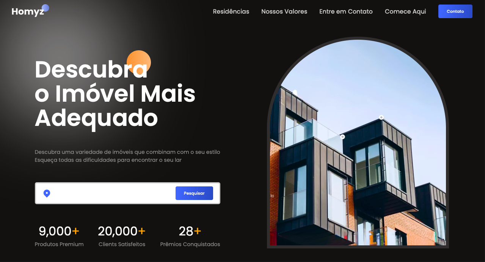
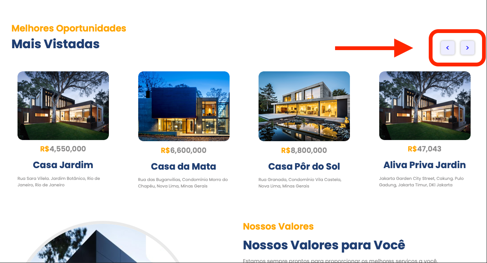
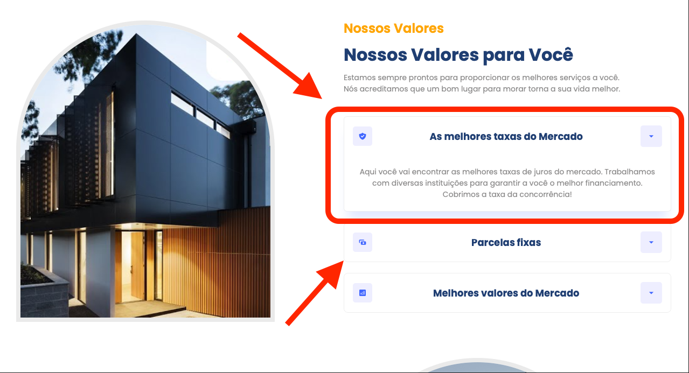
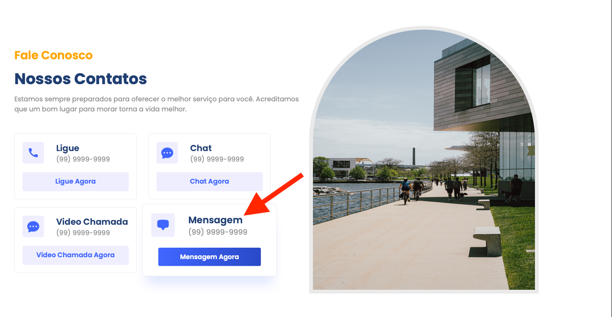
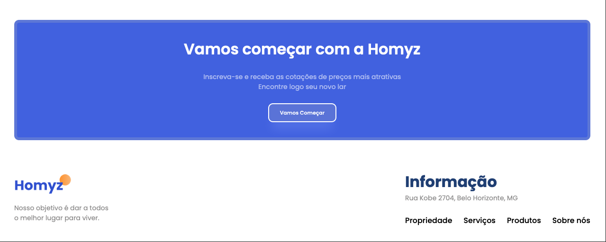

# CASA CONFORTO

This is a functional website I made using React for an imaginary real state client. 

## Table of contents

- [Overview](#overview)
  - [Deploy](#deploy )
  - [The challenge](#the-challenge)
  - [Screenshots](#screenshot)
  - [My process](#my-process)
  - [Built with](#built-with)
  - [What I learned](#what-i-learned)
  - [Continued development](#continued-development)
  - [Useful resources](#useful-resources)
- [Author](#author)
- [Acknowledgments](#acknowledgments)

## Overview

It was my first approach to React as I have only been using Vanilla. In this project I was able to work with animations, carousel and also accordion. Even thought it's not a very complex work I was happy to see how I am evolving as a developer and sharpening my solving problems skills. It's also full responsive.

### Deploy

https://real-sate-react.vercel.app

### The challenge

The main challenge here was to make my first project using React, creating animations, carousel and other built in solutions such as icons. In the end I'm very proud of what I've achieved, specially developing my solving problems skills.

### Screenshot

Header and Hero Sections

Residencies Section

Values Section

Contacts Section

Get Started and Footer Section

## My process

As I was using React I managed to divide my project into parts which made easier to overcome problems througout the development. Using documentations and searching skills was a key hability to finish this project.

### Built with

- HTML
- CSS
- JavaScript
- React
- Node Modules

### What I learned

Improved my skills working with React, animations, carousel, accordion and icons.

### Continued development

I now look forward improving my React Skills

### Useful-resources

React Documentation

## Author

Eduardo Vinagre (@eduvinagre)

## Acknowledgments

I'd like to thank Jean Meira for encouraging me into start using React. Cheers mate!

